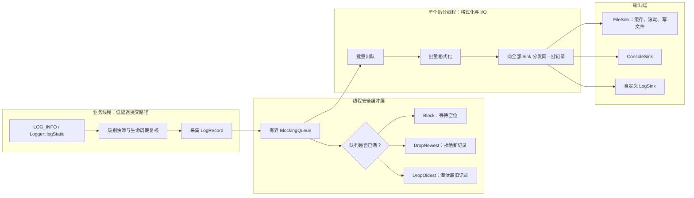
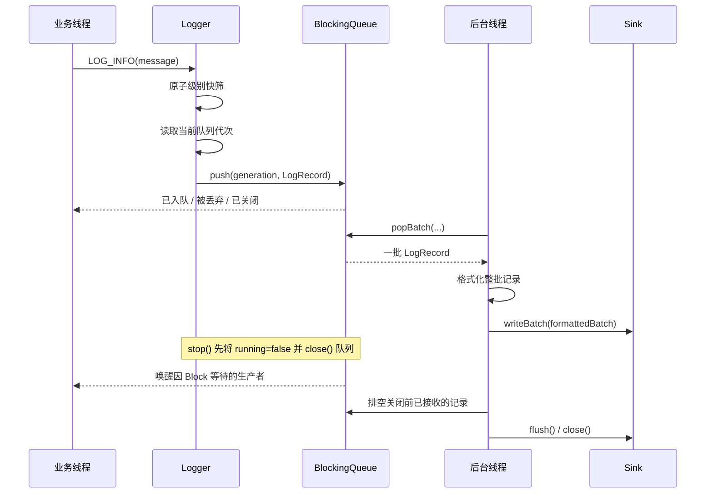

<div align="center">

# cpp_logger

**基于 C++17 的轻量级异步日志库**

[English](README_EN.md) | 简体中文


[](LICENSE)
[](https://github.com/qxf-72/cpp_logger/actions/workflows/ci.yml)

[](https://github.com/qxf-72/cpp_logger/stargazers)

</div>

`cpp_logger` 让业务线程快速提交 `LogRecord`，由后台线程统一完成格式化、批量写入和文件滚动。它适合作为学习 C++ 并发与异步 I/O 的完整项目，也可作为轻量级文件日志组件直接集成到 CMake 工程。

> 适用于本地文件日志与并发程序的可观测性；不以分布式日志或断电级持久化为目标。

## ✨ 核心能力

| 能力 | 说明 |
| --- | --- |
| 异步批量写入 | 将格式化与文件 I/O 移出业务线程；后台按批出队、格式化并写入。 |
| 有界队列与过载控制 | `Block`、`DropNewest`、`DropOldest` 三种队列满策略。 |
| 可观测性 | `droppedCount()`、`queueSize()`、`queuePeakSize()` 用于监控过载情况。 |
| 日志管理 | 五级过滤、毫秒时间戳、线程 ID、源位置、按日期/大小滚动。 |
| 输出端扩展 | 内置 `FileSink`、`ConsoleSink`，可接入自定义 `LogSink`。 |
| 工程化交付 | CTest、跨平台 GitHub Actions、格式化/静态分析/Sanitizer 门禁、CMake 安装与 `find_package` 包导出。 |

## 🧭 导航

- [快速开始](#-快速开始)
- [使用与配置](#-使用与配置)
- [核心数据流](#️-核心数据流)
- [测试、CI 与安装](#-测试ci-与安装)
- [性能测试](#-性能测试)

## 🚀 快速开始

### 环境要求

- C++17 编译器：GCC、Clang 或 MSVC
- CMake 3.14 或更高版本
- 推荐 Ninja；也可替换为本机可用的 CMake 生成器

从源码构建并运行测试：

```bash
git clone https://github.com/qxf-72/cpp_logger.git
cd cpp_logger

cmake -S . -B build -G Ninja -DCMAKE_BUILD_TYPE=Release
cmake --build build --parallel
```

验证构建结果：

```bash
ctest --test-dir build --output-on-failure
```

运行示例程序：

```bash
# Linux / macOS
./build/logger_demo

# Windows PowerShell
.\build\logger_demo.exe
```

日志默认写入 `logs/` 目录。

## 🧩 使用与配置

```cpp
#include <chrono>
#include <iostream>

#include "Logger.h"

int main() {
  LoggerConfig config;
  config.basePath = "logs/app";
  config.minLevel = LogLevel::DEBUG;
  config.maxFileSize = 10 * 1024 * 1024;
  config.queueCapacity = 8192;
  config.overflowPolicy = OverflowPolicy::Block;
  config.writeBatchSize = 256;
  config.flushPolicy = FlushPolicy::Periodic;
  config.flushInterval = std::chrono::seconds(1);
  config.flushAtOrAbove = LogLevel::ERROR;
  config.enableConsoleSink = true;
  config.consoleStream = ConsoleStream::Stdout;

  if (!Logger::instance().init(config)) {
    return 1;
  }

  LOG_DEBUG("debug message");
  LOG_INFO("program started");
  LOG_WARN("warning message");
  LOG_ERROR("error message");

  std::cout << "dropped=" << Logger::instance().droppedCount() << '\n';
  Logger::instance().stop();
}
```

`LOG_DEBUG`、`LOG_INFO`、`LOG_WARN`、`LOG_ERROR` 和 `LOG_FATAL` 会先检查日志级别，避免被过滤的日志构造不必要的消息。请在应用的顶层生命周期中显式调用 `stop()`；它负责排空已接收记录并关闭输出端。旧接口 `init("app", LogLevel::DEBUG, 10 * 1024 * 1024)` 仍可用。

### 队列满时的策略

| 策略 | 行为 | 适用场景 |
| --- | --- | --- |
| `OverflowPolicy::Block` | 阻塞生产者，直到后台线程取走日志或日志器关闭。 | 日志不能丢失。 |
| `OverflowPolicy::DropNewest` | 丢弃本次新日志并立即返回。 | 优先保障业务线程延迟。 |
| `OverflowPolicy::DropOldest` | 丢弃队列中最早的日志，保留最新日志。 | 排障时更关注最新状态。 |

`droppedCount()` 统计两种丢弃策略造成的日志损失；`queueSize()` 返回当前待写条数；`queuePeakSize()` 返回当前初始化周期内的队列峰值。每次成功 `init()` 都会重置这些统计值。

### 常用配置

| 配置 | 默认值 | 说明 |
| --- | ---: | --- |
| `queueCapacity` | `8192` | 有界队列容量（记录数）。 |
| `writeBatchSize` | `256` | 单次最多格式化并写入的记录数。 |
| `flushPolicy` | `Periodic` | `OnStop`、`Periodic`、`EveryBatch`。 |
| `flushInterval` | `1 s` | `Periodic` 模式的刷新周期。 |
| `flushAtOrAbove` | `ERROR` | 到达该级别及以上时，在当前批次内刷新。 |
| `maxFileSize` | `1 MiB` | 单个日志文件的最大大小。 |

`FileSink` 默认启用并负责按日期/大小滚动；`ConsoleSink` 可选，两个内置 Sink 可以同时启用。关闭文件输出后，`basePath` 不再是必填项；自定义 Sink 继承 `LogSink` 并放入 `additionalSinks` 即可。

> `flush()` 使用 `std::ofstream::flush()` 将 C++ 流缓冲刷新到操作系统，不等同于 `fsync`，因此不提供断电安全的持久化保证。

## 🏗️ 核心数据流



### 组件职责

| 组件 | 职责 | 所在线程 / 同步边界 |
| --- | --- | --- |
| `Logger` | 对外 API、级别过滤、生命周期管理；业务线程只创建原始 `LogRecord`。 | `shouldLog()` 使用原子变量快筛；提交时短暂读取生命周期和队列代次。 |
| `BlockingQueue<LogRecord>` | 有界缓冲、三种满队列策略、关闭唤醒、丢弃/长度/峰值统计。 | 内部互斥锁 + `notEmpty` / `notFull` 条件变量。 |
| `workerLoop()` | 批量出队、格式化、分发、按策略刷新。 | 唯一后台线程；不让格式化与文件 I/O 占用业务线程。 |
| `FileSink` | 按日期或大小滚动、暂存整批文本并一次写入流。 | 由后台线程串行调用，无需让业务线程竞争文件锁。 |
| `ConsoleSink` / 自定义 `LogSink` | 接收与文件 Sink 相同的已格式化批次。 | 由后台线程调用；自定义 Sink 的耗时会影响整体写入能力。 |

### 热路径与批量写入

业务线程会采集调用时刻、级别、线程 ID、源位置和正文，并将它们作为 `LogRecord` 入队；**不在业务线程拼接最终日志行**。后台线程一次取出至多 `writeBatchSize` 条记录，复用批量容器完成格式化，再把同一批已格式化文本广播给所有 Sink。

`FileSink` 会先把一批记录追加到内存中的 `pending` 缓冲，再执行一次 `ostream::write()`。这减少了逐条 `operator<<`、频繁锁竞争和系统调用的开销；日期前缀也会按秒缓存。代价是队列、内存和后台线程成为写入能力的共同上限，因此应按业务的可靠性与延迟目标选择溢出策略和容量。

`LOG_*` 宏先调用无锁的 `shouldLog()`，让被级别过滤的消息不产生构造开销；真正入队前仍会复核运行状态和级别，以保证并发安全。`logStatic()` 面向 `__FILE__` 这类静态生命周期文件名，避免复制它；普通 `log()` 会复制文件名。消息正文始终被复制到 `LogRecord`，因此调用方可传入临时字符串或 `std::string_view`。

### 并发与生命周期



- `Block` 入队等待空位时不会持有 `Logger` 的生命周期共享锁，因此 `stop()` 能取得独占锁、关闭队列并唤醒等待者，不会形成停止死锁。
- `stop()` 的语义是：拒绝新的记录、排空已接收记录、刷新并关闭全部 Sink。它不是 `fsync`，因此不承诺断电安全。
- `init()` 与 `stop()` 持生命周期独占锁；每次重新初始化都会重置队列并递增**队列代次**。旧生命周期中已读取到旧代次的生产者，即使稍后才执行入队，也会因代次不匹配而被拒绝，不能把旧日志写入新文件周期。
- `droppedCount()`、`queueSize()` 与 `queuePeakSize()` 都是当前初始化周期的统计；成功 `init()` 后从零开始。

### 刷新语义

| 策略 | 后台线程行为 | 适用取舍 |
| --- | --- | --- |
| `OnStop` | 正常运行时不主动刷新，停止排空时统一刷新。 | 吞吐优先；异常退出时最近内容可能仍留在流缓冲。 |
| `Periodic` | 使用带超时的批量出队，到达 `flushInterval` 时刷新，即使暂时没有新日志。 | 常用的吞吐与可见性平衡。 |
| `EveryBatch` | 每写完一个批次立即刷新。 | 可见性更高，但刷新开销更大。 |

无论选择哪种策略，`flushAtOrAbove` 都可以让包含指定严重级别及以上记录的批次立刻刷新。

### 目录对应关系

```text
include/Logger.h        公开 API、LoggerConfig、日志宏与 LogRecord 定义
include/BlockingQueue.h 有界队列、溢出策略、代次与统计
include/LogSink.h       可插拔 Sink 抽象
src/Logger.cpp          生命周期、后台循环、批量格式化与刷新策略
src/LogSink.cpp         FileSink / ConsoleSink、批量写入与文件滚动
```

日志行格式：

```text
[2026-06-25 12:00:00.123][INFO][tid:140123456789000][example.cpp:42] message
```

日志文件名为 `<前缀>_<日期>_<序号>.log`，例如 `app_2026-06-25_0.log`。

## ✅ 测试、CI 与安装

每次推送到 `main` 或创建 Pull Request 时，GitHub Actions 会在 Windows、Linux、macOS 上执行配置、构建、CTest 和 CMake 安装验证；并在 Linux 上执行以下质量门禁：

- 使用 `clang-format-18` 对所有受版本控制的 C++ 源文件进行只读格式检查；
- 以 Clang 编译并启用 `.clang-tidy` 中的缺陷、性能与可读性规则，任何已启用诊断都会令构建失败；
- 分别以 AddressSanitizer（ASan）和 ThreadSanitizer（TSan）插桩构建并运行 CTest。

本地仅运行测试：

```bash
ctest --test-dir build --output-on-failure
```

测试覆盖队列生命周期、满队列策略、初始化参数校验、日志过滤、安全停止排空、文件滚动、重新初始化和多线程写入。

### 本地复现质量检查

`LOGGER_ENABLE_CLANG_TIDY` 会在构建各项目标时运行静态分析。`LOGGER_ENABLE_ASAN` 与 `LOGGER_ENABLE_TSAN` 互斥，当前固定用于 Linux + Clang/GNU 环境；它们只影响本项目构建，不会传播给安装包消费者。

```bash
# clang-format（Bash / Git Bash）
git ls-files -z -- '*.cpp' '*.h' '*.hpp' | xargs -0 clang-format --dry-run --Werror --style=file

# clang-tidy
cmake -S . -B build-clang-tidy -G Ninja -DCMAKE_BUILD_TYPE=Debug -DCMAKE_CXX_COMPILER=clang++ -DBUILD_TESTING=ON -DLOGGER_ENABLE_CLANG_TIDY=ON
cmake --build build-clang-tidy --parallel
```

在 Linux 上复现 ASan（将 `ASAN` 改为 `TSAN` 即可运行另一套检查，二者不可同时开启）：

```bash
cmake -S . -B build-asan -G Ninja -DCMAKE_BUILD_TYPE=Debug -DCMAKE_CXX_COMPILER=clang++ -DBUILD_TESTING=ON -DLOGGER_BUILD_BENCHMARK=OFF -DLOGGER_ENABLE_ASAN=ON
cmake --build build-asan --parallel
ASAN_OPTIONS=detect_leaks=1:halt_on_error=1 ctest --test-dir build-asan --output-on-failure
```

### 作为 CMake 包使用

安装静态库、头文件和 CMake package：

```bash
cmake --install build --prefix <安装目录>
```

在消费者项目中：

```cmake
find_package(cpp_logger 0.1 CONFIG REQUIRED)

add_executable(app main.cpp)
target_link_libraries(app PRIVATE cpp_logger::logger)
```

配置消费者项目时指定安装目录：

```bash
cmake -S . -B build -DCMAKE_PREFIX_PATH=<安装目录>
```

GitHub Release 提供 Windows MSVC x64、Linux GCC x64 和 macOS AppleClang arm64 的预构建包，以及 `SHA256SUMS.txt` 校验文件。预构建静态库不能跨平台或跨编译器混用。

## 📊 性能测试

旧版表格混用了 MinGW/GCC 与 MSVC，并且 Quill 含有 MinGW 专用绕行，不能作为跨库排名。该历史数据已移除；新的基准把三套实现拆成独立进程，但复用同一套启动栅栏、预热、固定正文、计时、统计和落盘校验逻辑。正式对照应在同一台机器、同一 MSVC Release 构建树中重新生成。

### 统一构建环境

推荐 Windows 原生 x64、Visual Studio 2022 的 MSVC v143 工具链。以下命令在同一 CMake 构建树中编译 `cpp_logger`、Quill v9.0.3 和 spdlog v1.17.0：

```powershell
cmake -S . -B build-benchmark-msvc -G "Visual Studio 17 2022" -A x64 `
  -DBUILD_TESTING=OFF `
  -DLOGGER_BUILD_BENCHMARK=ON `
  -DLOGGER_BUILD_QUILL_BENCHMARK=ON -DLOGGER_FETCH_QUILL=ON `
  -DLOGGER_BUILD_SPDLOG_BENCHMARK=ON -DLOGGER_FETCH_SPDLOG=ON

cmake --build build-benchmark-msvc --config Release `
  --target cpp_logger_benchmark spdlog_benchmark quill_blocking_benchmark quill_dropping_benchmark `
  --parallel
```

第三方目标默认关闭，因此日常构建不会下载 Quill 或 spdlog。请记录 CPU、Windows 版本、MSVC 版本、CMake 版本和完整 CMake 配置；不要把 Linux/GCC 与 Windows/MSVC 的结果放入同一张比较表。

### 运行矩阵

默认工作负载为每生产者 250,000 条、128 B 正文、1 次完整预热和 10 次计量。主表使用 `final-drain`：生产完成后等待队列排空并显式刷新；`periodic` 仅用于单独考察定时刷新，不应与主表混用。

```powershell
$common = @("--threads", "4", "--messages", "250000", "--payload", "128", `
            "--warmups", "1", "--runs", "10", "--flush-mode", "final-drain")

# Block：三库均参与
& .\build-benchmark-msvc\Release\cpp_logger_benchmark.exe @common --queue-per-thread 2048 --profile block
& .\build-benchmark-msvc\Release\spdlog_benchmark.exe @common --queue-per-thread 2048 --profile block
& .\build-benchmark-msvc\Release\quill_blocking_benchmark.exe @common --profile block

# DropNewest：三库均参与
& .\build-benchmark-msvc\Release\cpp_logger_benchmark.exe @common --queue-per-thread 2048 --profile drop-newest
& .\build-benchmark-msvc\Release\spdlog_benchmark.exe @common --queue-per-thread 2048 --profile drop-newest
& .\build-benchmark-msvc\Release\quill_dropping_benchmark.exe @common --profile drop-newest

# DropOldest：Quill 没有等价队列，只比较 cpp_logger 与 spdlog
& .\build-benchmark-msvc\Release\cpp_logger_benchmark.exe @common --queue-per-thread 2048 --profile drop-oldest
& .\build-benchmark-msvc\Release\spdlog_benchmark.exe @common --queue-per-thread 2048 --profile drop-oldest
```

对 `4`、`8`、`16` 个生产者分别重复这组命令，并在每个线程数下交替运行不同实现，减少温度、缓存和后台任务造成的顺序偏差。`cpp_logger` 与 spdlog 的容量单位是“记录数”，Quill 的容量是“每生产者 SPSC 队列字节数”（固定 256 KiB）；它们不是严格相等的容量，因此结果会完整输出容量描述，比较时应以过载语义和实际保留量为主。

### 统计口径

每个可执行程序单独运行，避免 Quill 后端、spdlog 全局线程池或 registry 相互干扰。每轮在正文中嵌入唯一 marker；停止、排空并关闭文件后再扫描 `.log` 文件，校验实际落盘条数。校验和删除临时日志均不计入性能时间。

| 输出字段 | 含义 |
| --- | --- |
| `attempted_producer_logs_per_second` | 所有生产者尝试提交的速率；丢弃模式下不能代表可靠写入能力。 |
| `accepted_producer_logs_per_second` | 以最终保留记录数折算的生产者阶段速率。 |
| `delivered_end_to_end_logs_per_second` | 从统一起跑到后台排空、刷新完成后的实际落盘速率。 |
| `drop_rate_percent` | `attempted - delivered` 占尝试总数的比例，来自 marker 校验而非不同库的私有计数器。 |

输出先给出每次计量轮的 CSV 行，再给出最小值、中位数和最大值。

### 快速重测结果（MSVC）

环境：Windows x64、MSVC 19.40.33811、Visual Studio 2022 Generator、Release、Quill v9.0.3、spdlog v1.17.0。每组为每线程 100,000 条、128 B 正文、`final-drain`、1 次预热和 3 次计量；表中为中位数，吞吐量单位为万条/秒。`cpp_logger` 与 spdlog 使用每生产者 2,048 条记录的队列，Quill 使用每生产者 256 KiB SPSC 队列，容量单位不同，不能理解为严格等容量对照。

#### 4 个生产者

| 场景 / 实现 | 队列策略 | 生产者吞吐量 | 端到端吞吐量 | 丢弃率 |
| --- | --- | ---: | ---: | ---: |
| cpp_logger | Block | 139.83 | 136.89 | 0.00% |
| spdlog | Block | 52.68 | 52.26 | 0.00% |
| Quill | Block | 39.23 | 37.58 | 0.00% |
| cpp_logger | DropNewest | 480.26 | 137.93 | 69.00% |
| spdlog | DropNewest | 455.27 | 84.19 | 80.43% |
| Quill | DropNewest | 12,138.13 | 23.65 | 98.00% |
| cpp_logger | DropOldest | 380.01 | 138.24 | 62.67% |
| spdlog | DropOldest | 310.87 | 52.93 | 81.88% |

#### 8 个生产者

| 场景 / 实现 | 队列策略 | 生产者吞吐量 | 端到端吞吐量 | 丢弃率 |
| --- | --- | ---: | ---: | ---: |
| cpp_logger | Block | 108.40 | 106.54 | 0.00% |
| spdlog | Block | 36.53 | 36.32 | 0.00% |
| Quill | Block | 75.93 | 72.53 | 0.00% |
| cpp_logger | DropNewest | 332.69 | 119.00 | 63.12% |
| spdlog | DropNewest | 426.00 | 52.27 | 86.96% |
| Quill | DropNewest | 22,256.22 | 21.95 | 98.40% |
| cpp_logger | DropOldest | 269.42 | 124.48 | 51.91% |
| spdlog | DropOldest | 279.48 | 31.13 | 88.39% |

#### 16 个生产者

| 场景 / 实现 | 队列策略 | 生产者吞吐量 | 端到端吞吐量 | 丢弃率 |
| --- | --- | ---: | ---: | ---: |
| cpp_logger | Block | 86.15 | 84.96 | 0.00% |
| spdlog | Block | 35.56 | 35.34 | 0.00% |
| Quill | Block | 84.68 | 83.25 | 0.00% |
| cpp_logger | DropNewest | 329.70 | 26.81 | 91.44% |
| spdlog | DropNewest | 432.20 | 33.32 | 91.79% |
| Quill | DropNewest | 44,927.41 | 35.19 | 98.40% |
| cpp_logger | DropOldest | 156.67 | 81.78 | 46.18% |
| spdlog | DropOldest | 179.62 | 13.04 | 92.54% |

可靠模式应优先看端到端吞吐；丢弃模式的高生产者吞吐意味着调用方更快地放弃了记录，不能当作可靠写入能力。若用于最终对外结论，建议按上方命令把每组扩展到 10 次计量，并保留原始 CSV。

## 🗺️ 后续计划

- [x] 支持控制台与可插拔输出端
- [x] 建立 clang-format、clang-tidy、ASan 与 TSan 质量门禁
- [ ] 支持日志文件保留期与自动清理

## 🤝 贡献

欢迎提交 Issue 和 Pull Request。提交前请至少运行：

```bash
cmake --build build --parallel
ctest --test-dir build --output-on-failure
```

## 📄 许可证

本项目采用 [MIT License](LICENSE)。
