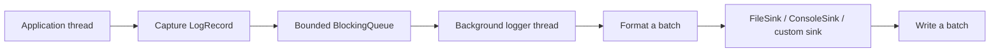

<div align="center">

# cpp_logger

**A lightweight asynchronous logging library for C++17**

English | [简体中文](README.md)


[](LICENSE)
[](https://github.com/qxf-72/cpp_logger/actions/workflows/ci.yml)

[](https://github.com/qxf-72/cpp_logger/stargazers)

</div>

`cpp_logger` lets application threads submit `LogRecord` objects quickly, while one background thread performs formatting, batched writes, and file rotation. It is both a complete C++ concurrency / asynchronous-I/O learning project and a lightweight file-logging component for CMake projects.

> Intended for local file logging and observability in concurrent programs; it is not a distributed-logging or power-loss-durability solution.

## ✨ Highlights

| Capability | Details |
| --- | --- |
| Asynchronous batched output | Formatting and file I/O leave the application thread; the backend pops, formats, and writes records in batches. |
| Bounded queue and overload control | `Block`, `DropNewest`, and `DropOldest` policies for a full queue. |
| Observability | `droppedCount()`, `queueSize()`, and `queuePeakSize()` expose overload state. |
| Log management | Five levels, millisecond timestamps, thread IDs, source locations, and date/size rotation. |
| Extensible output | Built-in `FileSink` and `ConsoleSink`, plus custom `LogSink` support. |
| Engineering support | CTest, cross-platform GitHub Actions, format/static-analysis/Sanitizer gates, CMake installation, and `find_package` package export. |

## 🧭 Contents

- [Quick Start](#-quick-start)
- [Usage and Configuration](#-usage-and-configuration)
- [Core Data Flow](#️-core-data-flow)
- [Tests, CI, and Installation](#-tests-ci-and-installation)
- [Benchmark](#-benchmark)

## 🚀 Quick Start

### Requirements

- A C++17 compiler: GCC, Clang, or MSVC
- CMake 3.14 or later
- Ninja is recommended; another available CMake generator also works

Build from source and run tests:

```bash
git clone https://github.com/qxf-72/cpp_logger.git
cd cpp_logger

cmake -S . -B build -G Ninja -DCMAKE_BUILD_TYPE=Release
cmake --build build --parallel
```

Verify the build:

```bash
ctest --test-dir build --output-on-failure
```

Run the demo:

```bash
# Linux / macOS
./build/logger_demo

# Windows PowerShell
.\build\logger_demo.exe
```

Logs are written to `logs/` by default.

## 🧩 Usage and Configuration

```cpp
#include <chrono>
#include <iostream>

#include "Logger.h"

int main() {
  LoggerConfig config;
  config.basePath = "logs/app";
  config.minLevel = LogLevel::DEBUG;
  config.maxFileSize = 10 * 1024 * 1024;
  config.queueCapacity = 8192;
  config.overflowPolicy = OverflowPolicy::Block;
  config.writeBatchSize = 256;
  config.flushPolicy = FlushPolicy::Periodic;
  config.flushInterval = std::chrono::seconds(1);
  config.flushAtOrAbove = LogLevel::ERROR;
  config.enableConsoleSink = true;
  config.consoleStream = ConsoleStream::Stdout;

  if (!Logger::instance().init(config)) {
    return 1;
  }

  LOG_DEBUG("debug message");
  LOG_INFO("program started");
  LOG_WARN("warning message");
  LOG_ERROR("error message");

  std::cout << "dropped=" << Logger::instance().droppedCount() << '\n';
  Logger::instance().stop();
}
```

`LOG_DEBUG`, `LOG_INFO`, `LOG_WARN`, `LOG_ERROR`, and `LOG_FATAL` check the configured level before evaluating the message expression, avoiding unnecessary message construction for filtered records. Call `stop()` explicitly from the application's top-level lifecycle; it drains accepted records and closes output sinks. The legacy `init("app", LogLevel::DEBUG, 10 * 1024 * 1024)` overload remains available.

### Full-Queue Policies

| Policy | Behavior | Suitable when |
| --- | --- | --- |
| `OverflowPolicy::Block` | Blocks producers until the backend consumes a record or the logger closes. | Logs cannot be lost. |
| `OverflowPolicy::DropNewest` | Drops the incoming record and returns immediately. | Application latency takes priority. |
| `OverflowPolicy::DropOldest` | Removes the oldest queued record and retains the newest one. | The latest state matters most during diagnosis. |

`droppedCount()` counts losses from either drop policy. `queueSize()` reports pending records, and `queuePeakSize()` reports the high-water mark for the current initialization. A successful `init()` resets these statistics.

### Common Settings

| Setting | Default | Details |
| --- | ---: | --- |
| `queueCapacity` | `8192` | Bounded queue capacity in records. |
| `writeBatchSize` | `256` | Maximum records formatted and written together. |
| `flushPolicy` | `Periodic` | `OnStop`, `Periodic`, or `EveryBatch`. |
| `flushInterval` | `1 s` | Flush interval for `Periodic`. |
| `flushAtOrAbove` | `ERROR` | Flushes the current batch at or above this level. |
| `maxFileSize` | `1 MiB` | Maximum size of one log file. |

`FileSink` is enabled by default and rotates files by date/size. `ConsoleSink` is optional, and both built-in sinks can be enabled together. When the file sink is disabled, `basePath` is no longer required. Derive a custom sink from `LogSink` and add it to `additionalSinks`.

> `flush()` uses `std::ofstream::flush()` to flush the C++ stream to the operating system. It is not `fsync`, so it does not provide power-loss durability.

## 🏗️ Core Data Flow



- Application threads capture the timestamp, level, thread ID, source location, and message, then enqueue the record; string formatting is deferred to the backend thread.
- `stop()` rejects later writes, drains accepted records, flushes, and closes all sinks.
- Lifecycle synchronization and queue generations prevent producers from an old lifecycle from writing into a reinitialized queue.

The log line format is:

```text
[2026-06-25 12:00:00.123][INFO][tid:140123456789000][example.cpp:42] message
```

Files use `<prefix>_<date>_<index>.log`, for example `app_2026-06-25_0.log`.

## ✅ Tests, CI, and Installation

On every push to `main` and every pull request, GitHub Actions configures, builds, runs CTest, and validates CMake installation on Windows, Linux, and macOS. Linux also runs these quality gates:

- `clang-format-18` performs a read-only format check on every tracked C++ source file.
- A Clang build enables the defect, performance, and readability checks in `.clang-tidy`; every enabled diagnostic fails the build.
- Separate AddressSanitizer (ASan) and ThreadSanitizer (TSan) builds run CTest.

Run tests locally:

```bash
ctest --test-dir build --output-on-failure
```

Tests cover queue lifecycle, full-queue policies, configuration validation, level filtering, safe drain on shutdown, file rotation, reinitialization, and concurrent logging.

### Reproduce Quality Checks Locally

`LOGGER_ENABLE_CLANG_TIDY` runs static analysis while project targets compile. `LOGGER_ENABLE_ASAN` and `LOGGER_ENABLE_TSAN` are mutually exclusive and are currently intended for Linux with Clang/GNU; they affect this project build only and are not propagated to package consumers.

```bash
# clang-format (Bash / Git Bash)
git ls-files -z -- '*.cpp' '*.h' '*.hpp' | xargs -0 clang-format --dry-run --Werror --style=file

# clang-tidy
cmake -S . -B build-clang-tidy -G Ninja -DCMAKE_BUILD_TYPE=Debug -DCMAKE_CXX_COMPILER=clang++ -DBUILD_TESTING=ON -DLOGGER_ENABLE_CLANG_TIDY=ON
cmake --build build-clang-tidy --parallel
```

To reproduce ASan on Linux (replace `ASAN` with `TSAN` for the other check; do not enable both):

```bash
cmake -S . -B build-asan -G Ninja -DCMAKE_BUILD_TYPE=Debug -DCMAKE_CXX_COMPILER=clang++ -DBUILD_TESTING=ON -DLOGGER_BUILD_BENCHMARK=OFF -DLOGGER_ENABLE_ASAN=ON
cmake --build build-asan --parallel
ASAN_OPTIONS=detect_leaks=1:halt_on_error=1 ctest --test-dir build-asan --output-on-failure
```

### Use as a CMake Package

Install the static library, headers, and CMake package:

```bash
cmake --install build --prefix <install-prefix>
```

Consume it from another project:

```cmake
find_package(cpp_logger 0.1 CONFIG REQUIRED)

add_executable(app main.cpp)
target_link_libraries(app PRIVATE cpp_logger::logger)
```

Pass the installation prefix while configuring the consumer:

```bash
cmake -S . -B build -DCMAKE_PREFIX_PATH=<install-prefix>
```

GitHub Releases provide prebuilt packages for Windows MSVC x64, Linux GCC x64, and macOS AppleClang arm64, together with `SHA256SUMS.txt`. Prebuilt static libraries must not be mixed across platforms or compiler toolchains.

## 📊 Benchmark

The regular benchmark reports both producer submission throughput and end-to-end throughput after `stop()` drains and flushes the queue:

```bash
# Linux / macOS
./build/logger_benchmark --threads 4 --messages 50000 --payload 128 --runs 5

# Windows PowerShell
.\build\logger_benchmark.exe --threads 4 --messages 50000 --payload 128 --runs 5
```

| Option | Description |
| --- | --- |
| `--threads <N>` | Producer count. |
| `--messages <N>` | Records submitted per producer. |
| `--payload <N>` | Message-body size in bytes. |
| `--runs <N>` | Number of repeated runs. |
| `--batch-size <N>` | Backend writer batch size. |
| `--flush-policy <...>` | `on-stop`, `periodic`, or `every-batch`. |

In one local Release measurement, `cpp_logger` achieved **123.80 × 10k records/s** end-to-end using Windows, MSYS2 MinGW-w64 GCC 15.2.0, four producers, 250,000 records per producer, a 128-byte payload, `Block + Periodic 1 s`, and the mean of three runs.

<details>
<summary><strong>Expand for reference data across implementations/toolchains, commands, and full results</strong></summary>

Third-party targets are off by default and do not affect normal builds. Quill is pinned to v9.0.3 and spdlog to v1.17.0.

```bash
# Quill: Ninja / Release
cmake -S . -B build-quill -G Ninja -DCMAKE_BUILD_TYPE=Release -DLOGGER_BUILD_QUILL_BENCHMARK=ON -DLOGGER_FETCH_QUILL=ON
cmake --build build-quill --target logger_quill_blocking_benchmark logger_quill_dropping_benchmark --parallel

# spdlog: Windows MSVC x64 / Release
cmake -S . -B build-spdlog-msvc -G "Visual Studio 17 2022" -A x64 -DLOGGER_BUILD_SPDLOG_BENCHMARK=ON -DLOGGER_FETCH_SPDLOG=ON
cmake --build build-spdlog-msvc --config Release --target logger_spdlog_benchmark --parallel
```

Quill uses separate executables for reliable and drop-newest profiles. spdlog's `Block` and `DiscardNew` align with those two semantics. `DropOldest` / `OverrunOldest` are omitted because no equivalent data were measured in the same run and toolchain.

The cpp_logger and Quill rows were measured on 2026-07-26 using Windows, MSYS2 MinGW-w64 GCC 15.2.0, and Release. The spdlog rows were independently measured on 2026-07-27 using Windows, Visual Studio 2022 x64, MSVC 19.40.33811, and Release. Every configuration used three runs, 250,000 records per producer, a 128-byte payload, and one-second periodic flushing. Compilers, queue topologies, formatters, and sinks differ, so the table describes specific configurations and **is not a strict cross-library ranking**.

#### 4 producers

| Scenario / implementation | Queue policy | Producer rate (10k records/s) | End-to-end rate (10k records/s) | Drop rate |
| --- | --- | ---: | ---: | ---: |
| Reliable / periodic (`cpp_logger`) | Block | 124.92 | 123.80 | 0.0000% |
| Reliable / periodic (spdlog, MSVC) | Block | 48.30 | 48.16 | 0.0000% |
| Reliable / periodic (Quill) | UnboundedBlocking | 874.92 | 80.53 | 0.0000% |
| Loss-tolerant / discard newest (`cpp_logger`) | DropNewest | 309.61 | 120.15 | 60.3628% |
| Loss-tolerant / discard newest (spdlog, MSVC) | DiscardNew | 460.29 | 76.98 | 82.7957% |
| Loss-tolerant / discard newest (Quill) | BoundedDropping | 5273.86 | 80.30 | 97.4055% |

#### 8 producers

| Scenario / implementation | Queue policy | Producer rate (10k records/s) | End-to-end rate (10k records/s) | Drop rate |
| --- | --- | ---: | ---: | ---: |
| Reliable / periodic (`cpp_logger`) | Block | 103.37 | 102.60 | 0.0000% |
| Reliable / periodic (spdlog, MSVC) | Block | 33.91 | 33.83 | 0.0000% |
| Reliable / periodic (Quill) | UnboundedBlocking | 943.82 | 73.11 | 0.0000% |
| Loss-tolerant / discard newest (`cpp_logger`) | DropNewest | 230.12 | 103.53 | 54.2425% |
| Loss-tolerant / discard newest (spdlog, MSVC) | DiscardNew | 428.28 | 47.40 | 88.6532% |
| Loss-tolerant / discard newest (Quill) | BoundedDropping | 5906.90 | 65.62 | 97.8928% |

#### 16 producers

| Scenario / implementation | Queue policy | Producer rate (10k records/s) | End-to-end rate (10k records/s) | Drop rate |
| --- | --- | ---: | ---: | ---: |
| Reliable / periodic (`cpp_logger`) | Block | 72.30 | 71.62 | 0.0000% |
| Reliable / periodic (spdlog, MSVC) | Block | 33.77 | 33.70 | 0.0000% |
| Reliable / periodic (Quill) | UnboundedBlocking | 843.36 | 68.28 | 0.0000% |
| Loss-tolerant / discard newest (`cpp_logger`) | DropNewest | 123.35 | 36.84 | 69.7742% |
| Loss-tolerant / discard newest (spdlog, MSVC) | DiscardNew | 463.51 | 26.23 | 94.1834% |
| Loss-tolerant / discard newest (Quill) | BoundedDropping | 6194.27 | 46.62 | 98.3951% |

- High producer rates in dropping modes come with high drop rates and do not indicate reliable-write capacity.
- Choose a library or overflow policy using end-to-end throughput, retained-record count, latency, and the application's tolerated-loss budget together.

</details>

## 🗺️ Roadmap

- [x] Console and pluggable output sinks
- [x] clang-format, clang-tidy, ASan, and TSan quality gates
- [ ] Log-retention and automatic-cleanup policies

## 🤝 Contributing

Issues and pull requests are welcome. Before submitting code, run:

```bash
cmake --build build --parallel
ctest --test-dir build --output-on-failure
```

## 📄 License

Licensed under the [MIT License](LICENSE).
