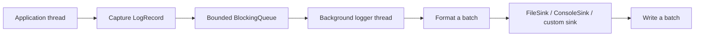

<div align="center">

# cpp_logger

**A lightweight asynchronous logging library for C++17**

English | [简体中文](README.md)


[](https://github.com/qxf-72/cpp_logger/actions/workflows/ci.yml)

[](LICENSE)


</div>

`cpp_logger` queues log records in application threads, then lets a background thread format and write them to files in batches. It includes configurable overload policies, file rotation, flush policies, runtime statistics, CTest coverage, and an installable CMake package.

## ✨ Highlights

| Capability | Details |
| --- | --- |
| Asynchronous writing | Application threads submit `LogRecord` objects; the background thread formats, rotates, and dispatches them to sinks. |
| Bounded queue | `Block`, `DropNewest`, and `DropOldest` policies are available when the queue is full. |
| Batch processing | Records are popped, formatted, and written in batches to reduce synchronization and stream overhead. |
| Observability | `droppedCount()`, `queueSize()`, and `queuePeakSize()` expose queue state. |
| Log management | Five levels, millisecond timestamps, thread IDs, source locations, and date/size rotation. |
| Shutdown and flushing | On-stop, periodic, and per-batch flushing; `stop()` drains accepted records. |
| Multiple sinks | Built-in rotating `FileSink` and `ConsoleSink`, plus custom `LogSink` support. |
| Tooling | CTest, cross-platform GitHub Actions CI, and `find_package` package export. |

## 🚀 Quick Start

### Requirements

- A C++17 compiler: GCC, Clang, or MSVC
- CMake 3.14 or later
- Ninja is recommended; another locally available CMake generator also works

The commands below use Ninja:

```bash
git clone https://github.com/qxf-72/cpp_logger.git
cd cpp_logger

cmake -S . -B build -G Ninja -DCMAKE_BUILD_TYPE=Release
cmake --build build --parallel
ctest --test-dir build --output-on-failure
```

Run the demo:

```bash
# Linux / macOS
./build/logger_demo

# Windows PowerShell
.\build\logger_demo.exe
```

Logs are written to `logs/` by default.

## 🧩 Usage

```cpp
#include <chrono>
#include <iostream>

#include "Logger.h"

int main() {
  LoggerConfig config;
  config.basePath = "logs/app";
  config.minLevel = LogLevel::DEBUG;
  config.maxFileSize = 10 * 1024 * 1024;
  config.queueCapacity = 8192;
  config.overflowPolicy = OverflowPolicy::Block;
  config.writeBatchSize = 256;
  config.flushPolicy = FlushPolicy::Periodic;
  config.flushInterval = std::chrono::seconds(1);
  config.flushAtOrAbove = LogLevel::ERROR;
  config.enableConsoleSink = true;
  config.consoleStream = ConsoleStream::Stdout;

  if (!Logger::instance().init(config)) {
    return 1;
  }

  LOG_DEBUG("debug message");
  LOG_INFO("program started");
  LOG_WARN("warning message");
  LOG_ERROR("error message");

  std::cout << "dropped=" << Logger::instance().droppedCount() << '\n';
  Logger::instance().stop();
}
```

`LOG_DEBUG`, `LOG_INFO`, `LOG_WARN`, `LOG_ERROR`, and `LOG_FATAL` check the configured level before evaluating the message expression, avoiding unnecessary string construction for filtered logs.

The original `init("app", LogLevel::DEBUG, 10 * 1024 * 1024)` overload remains available. It uses the default capacity of `8192`, the `Block` policy, 256-record batches, and periodic flushing.

### Full-Queue Policies

| Policy | Behavior | Suitable when |
| --- | --- | --- |
| `OverflowPolicy::Block` | Blocks producers until the background thread consumes a record or the logger closes. | Logs cannot be lost. |
| `OverflowPolicy::DropNewest` | Drops the incoming record and returns immediately. | Application latency takes priority. |
| `OverflowPolicy::DropOldest` | Removes the oldest queued record and retains the incoming one. | The latest state is most useful for diagnosis. |

`droppedCount()` counts losses caused by either drop policy. `queueSize()` is the pending-record count, while `queuePeakSize()` is the peak size for the current initialization. A successful `init()` resets all three statistics.

### Batching and Flushing

| Setting | Meaning |
| --- | --- |
| `writeBatchSize` | Maximum records formatted and written together; defaults to `256`. |
| `FlushPolicy::OnStop` | Flushes only in `stop()`, except records at `flushAtOrAbove`. |
| `FlushPolicy::Periodic` | Flushes at `flushInterval`, one second by default; this is the default policy. |
| `FlushPolicy::EveryBatch` | Flushes after every writer batch, improving visibility at a higher cost. |

`flushAtOrAbove` defaults to `LogLevel::ERROR`; set it to `std::nullopt` to disable level-triggered flushes. The `std::ofstream::flush()` used by `FileSink` flushes the C++ stream to the operating system, but is not `fsync` and does not provide power-loss durability.

### Output Sinks

`FileSink` is enabled by default and handles date/size rotation. `ConsoleSink` is optional and writes to standard output or standard error. Both built-in sinks can be enabled together and receive the same formatted batch:

```cpp
config.enableFileSink = true;               // Default; basePath is required when enabled.
config.enableConsoleSink = true;
config.consoleStream = ConsoleStream::Stderr;
```

When the file sink is disabled, `basePath` is no longer required and the logger can use only the console or custom sinks. Derive a custom sink from `LogSink` and add it to `additionalSinks`; its `writeBatch()`, `flush()`, and `close()` methods are all called by the background logger thread.

## 🏗️ Core Data Flow



- Application threads capture the timestamp, level, thread ID, source location, and message, then enqueue the record; string formatting is deferred to the background thread.
- `close()` wakes waiting threads. `stop()` rejects later writes, drains accepted records, then flushes and closes the file.
- Lifecycle synchronization and queue generations prevent producers from an old lifecycle writing into a reinitialized queue.

The log format is:

```text
[2026-06-25 12:00:00.123][INFO][tid:140123456789000][example.cpp:42] message
```

Log files use `<prefix>_<date>_<index>.log`, for example `app_2026-06-25_0.log`. A new file is created when the date changes or the file reaches `maxFileSize`.

## ✅ Tests and CI

On every push to `main` and every pull request, GitHub Actions configures, builds, runs CTest, and validates CMake installation on Windows, Linux, and macOS.

Run tests locally:

```bash
ctest --test-dir build --output-on-failure
```

Tests cover queue lifecycle and overload policies, configuration validation, level filtering, safe draining during `stop()`, size rotation, reinitialization, and concurrent logging.

## 📦 Install and Use as a CMake Package

Install the static library, headers, and CMake package after building:

```bash
cmake --install build --prefix <install-prefix>
```

Consume it from another CMake project:

```cmake
find_package(cpp_logger 0.1 CONFIG REQUIRED)

add_executable(app main.cpp)
target_link_libraries(app PRIVATE cpp_logger::logger)
```

Pass the installation prefix when configuring the consumer:

```bash
cmake -S . -B build -DCMAKE_PREFIX_PATH=<install-prefix>
```

### Use a Prebuilt Package from GitHub Releases

Starting with `v0.1.1`, pushing a `vX.Y.Z` tag that matches the CMake project version automatically builds and publishes prebuilt CMake packages. Download and extract the asset matching your platform, compiler, and architecture; cloning this repository is not required:

```bash
cmake -S . -B build -DCMAKE_PREFIX_PATH=<extracted cpp_logger directory>
cmake --build build --parallel
```

Packages are provided for Windows MSVC x64, Linux GCC x64, and macOS AppleClang arm64. Each Release includes `SHA256SUMS.txt` for verification. Prebuilt static libraries must not be mixed across platforms or compiler toolchains.

## 📊 Benchmark

The regular benchmark target is enabled by default and produces CSV output. It reports both producer submission throughput and end-to-end throughput after `stop()` drains and flushes the queue.

```bash
# Linux / macOS
./build/logger_benchmark --threads 4 --messages 50000 --payload 128 --runs 5

# Windows PowerShell
.\build\logger_benchmark.exe --threads 4 --messages 50000 --payload 128 --runs 5
```

| Option | Description |
| --- | --- |
| `--threads <N>` | Producer count; default: 4. |
| `--messages <N>` | Records per producer; default: 50000. |
| `--payload <N>` | Message body size in bytes; default: 128. |
| `--runs <N>` | Repeated runs; default: 3. |
| `--batch-size <N>` | Writer batch size; default: 256. |
| `--flush-policy <...>` | `on-stop`, `periodic`, or `every-batch`. |

Optional third-party comparisons pin Quill to v9.0.3 and spdlog to v1.17.0. They are off by default, so regular builds do not download dependencies. If an exact local version is unavailable, CMake can fetch it into the build tree:

```bash
cmake -S . -B build-quill -G Ninja -DCMAKE_BUILD_TYPE=Release -DLOGGER_BUILD_QUILL_BENCHMARK=ON -DLOGGER_FETCH_QUILL=ON
cmake --build build-quill --target logger_quill_blocking_benchmark logger_quill_dropping_benchmark --parallel

# Linux / macOS
./build-quill/logger_quill_blocking_benchmark --threads 4 --messages 250000 --payload 128 --runs 3
./build-quill/logger_quill_dropping_benchmark --threads 4 --messages 250000 --payload 128 --runs 3

# Windows PowerShell: producer-scaling experiment.
foreach ($threads in 4, 8, 16) {
  .\build-quill\logger_quill_blocking_benchmark.exe --threads $threads --messages 250000 --payload 128 --runs 3
  .\build-quill\logger_quill_dropping_benchmark.exe --threads $threads --messages 250000 --payload 128 --runs 3
}
```

The spdlog benchmark is built independently. It uses the pinned header-only target and one async worker, so it does not share global backend state with Quill. The following Windows MSVC x64 commands produced the spdlog rows in this table:

```bash
cmake -S . -B build-spdlog-msvc -G "Visual Studio 17 2022" -A x64 -DLOGGER_BUILD_SPDLOG_BENCHMARK=ON -DLOGGER_FETCH_SPDLOG=ON
cmake --build build-spdlog-msvc --config Release --target logger_spdlog_benchmark --parallel

# Windows PowerShell: run only the two profiles aligned with the table.
foreach ($threads in 4, 8, 16) {
  .\build-spdlog-msvc\Release\logger_spdlog_benchmark.exe --threads $threads --messages 250000 --payload 128 --runs 3 --profile reliable_periodic
  .\build-spdlog-msvc\Release\logger_spdlog_benchmark.exe --threads $threads --messages 250000 --payload 128 --runs 3 --profile discard_new
}
```

Quill requires a thread to use only one `FrontendOptions` type, so reliable and drop-newest profiles are separate executables. spdlog v1.17.0's `Block` and `DiscardNew` align with those two scenarios. Its `OverrunOldest` policy preserves newer records, but there is no freshly measured `cpp_logger::DropOldest` counterpart in this run, so it is omitted from the cross-library tables. `DropOldest` remains covered by unit tests.

### Local Quill and spdlog comparison results

The `cpp_logger` and Quill rows retain results from 2026-07-26 on Windows, MSYS2 MinGW-w64 GCC 15.2.0, and Release. The spdlog v1.17.0 rows were independently rerun on 2026-07-27 with Windows, Visual Studio 2022 x64, MSVC 19.40.33811, and Release. Every configuration used three runs, 250,000 records per producer, a 128-byte payload, local-time millisecond text-file output, and one-second periodic flushing. Rates are derived from the mean duration across the three runs. Because the compilers differ, the spdlog rows describe only this specific configuration and cannot support a strict cross-library ranking.

All implementations use one background thread for formatting and file I/O. `cpp_logger` uses `2048 × producer count` record slots and a batch size of 256. spdlog uses a global MPMC async queue with the same `2048 × producer count` record capacity. Quill uses `UnboundedBlocking` for reliable delivery (256 KiB initial and 64 MiB maximum per producer) and a 256 KiB-per-producer `BoundedDropping` queue for drop-newest. Queue topology and capacity units are not identical, so this is a **semantically aligned** end-to-end experiment, not a capacity-identical microbenchmark. Quill's backend uses busy waiting with idle `yield` here because Windows expands its default 500 ns idle sleep to millisecond-scale scheduling delays; this increases CPU use and should not be extrapolated to low-CPU scenarios.

`cpp_logger` drop counts come from `droppedCount()`. Quill drop counts are collected from its enqueue return value, and spdlog counts come from the async thread pool's `discard_counter()`. Producer throughput includes every attempted submission; end-to-end throughput includes only retained records that were formatted and flushed to the output file.

#### 4 producers

| Scenario / implementation | Queue policy | Flush policy | Producer rate (10k logs/s) | End-to-end rate (10k logs/s) | Drop rate |
| --- | --- | --- | ---: | ---: | ---: |
| Reliable / periodic (`cpp_logger`) | Block | Periodic 1 s | 124.92 | 123.80 | 0.0000% |
| Reliable / periodic (spdlog v1.17.0, MSVC) | Block | Periodic 1 s | 48.30 | 48.16 | 0.0000% |
| Reliable / periodic (Quill) | UnboundedBlocking | Periodic 1 s | 874.92 | 80.53 | 0.0000% |
| Loss-tolerant / discard newest (`cpp_logger`) | DropNewest | Periodic 1 s | 309.61 | 120.15 | 60.3628% |
| Loss-tolerant / discard newest (spdlog v1.17.0, MSVC) | DiscardNew | Periodic 1 s | 460.29 | 76.98 | 82.7957% |
| Loss-tolerant / discard newest (Quill) | BoundedDropping | Periodic 1 s | 5273.86 | 80.30 | 97.4055% |

#### 8 producers

| Scenario / implementation | Queue policy | Flush policy | Producer rate (10k logs/s) | End-to-end rate (10k logs/s) | Drop rate |
| --- | --- | --- | ---: | ---: | ---: |
| Reliable / periodic (`cpp_logger`) | Block | Periodic 1 s | 103.37 | 102.60 | 0.0000% |
| Reliable / periodic (spdlog v1.17.0, MSVC) | Block | Periodic 1 s | 33.91 | 33.83 | 0.0000% |
| Reliable / periodic (Quill) | UnboundedBlocking | Periodic 1 s | 943.82 | 73.11 | 0.0000% |
| Loss-tolerant / discard newest (`cpp_logger`) | DropNewest | Periodic 1 s | 230.12 | 103.53 | 54.2425% |
| Loss-tolerant / discard newest (spdlog v1.17.0, MSVC) | DiscardNew | Periodic 1 s | 428.28 | 47.40 | 88.6532% |
| Loss-tolerant / discard newest (Quill) | BoundedDropping | Periodic 1 s | 5906.90 | 65.62 | 97.8928% |

#### 16 producers

| Scenario / implementation | Queue policy | Flush policy | Producer rate (10k logs/s) | End-to-end rate (10k logs/s) | Drop rate |
| --- | --- | --- | ---: | ---: | ---: |
| Reliable / periodic (`cpp_logger`) | Block | Periodic 1 s | 72.30 | 71.62 | 0.0000% |
| Reliable / periodic (spdlog v1.17.0, MSVC) | Block | Periodic 1 s | 33.77 | 33.70 | 0.0000% |
| Reliable / periodic (Quill) | UnboundedBlocking | Periodic 1 s | 843.36 | 68.28 | 0.0000% |
| Loss-tolerant / discard newest (`cpp_logger`) | DropNewest | Periodic 1 s | 123.35 | 36.84 | 69.7742% |
| Loss-tolerant / discard newest (spdlog v1.17.0, MSVC) | DiscardNew | Periodic 1 s | 463.51 | 26.23 | 94.1834% |
| Loss-tolerant / discard newest (Quill) | BoundedDropping | Periodic 1 s | 6194.27 | 46.62 | 98.3951% |

Analysis:

- All three reliable profiles retain their records. spdlog's MSVC figures use a global MPMC queue and one worker, while the cpp_logger and Quill rows come from MinGW. Compiler, standard-library, and file-I/O implementation differences affect the results, so they cannot be treated as a strict cross-library throughput ranking.
- In discard-newest mode, Quill and spdlog submit attempts quickly but reject roughly 82.8% to more than 97% of them. Those figures are not reliable-write capacity. End-to-end throughput must be considered together with retained-record count and the application's loss budget.
- spdlog's async queue, Quill's per-producer SPSC queue, their formatters, and their file sinks all differ from this project. These data only describe the configurations above; they are not a general cross-platform, cross-compiler, or cross-storage ranking.
- `DropOldest` remains covered by this project's unit tests. spdlog's `OverrunOldest` is related, but because this run did not remeasure the matching `cpp_logger::DropOldest` profile, it is not placed in the table or used for a horizontal conclusion.

CPU, storage, filesystem cache, compiler, and system load affect these results; rerun the commands on the same machine when comparing revisions.

## 🗺️ Roadmap

- [x] Console and pluggable output sinks
- [ ] Log-retention and automatic-cleanup policies
- [ ] More CI checks, including formatting and static analysis

## 🤝 Contributing

Issues and pull requests are welcome. Before submitting code, run:

```bash
cmake --build build --parallel
ctest --test-dir build --output-on-failure
```

## 📄 License

Licensed under the [MIT License](LICENSE).
