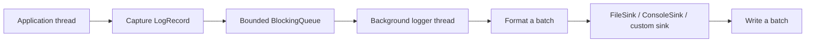

<div align="center">

# cpp_logger

**A lightweight asynchronous logging library for C++17**

English | [简体中文](README.md)


[](LICENSE)
[](https://github.com/qxf-72/cpp_logger/actions/workflows/ci.yml)

[](https://github.com/qxf-72/cpp_logger/stargazers)

</div>

`cpp_logger` lets application threads submit `LogRecord` objects quickly, while one background thread performs formatting, batched writes, and file rotation. It is both a complete C++ concurrency / asynchronous-I/O learning project and a lightweight file-logging component for CMake projects.

> Intended for local file logging and observability in concurrent programs; it is not a distributed-logging or power-loss-durability solution.

## ✨ Highlights

| Capability | Details |
| --- | --- |
| Asynchronous batched output | Formatting and file I/O leave the application thread; the backend pops, formats, and writes records in batches. |
| Bounded queue and overload control | `Block`, `DropNewest`, and `DropOldest` policies for a full queue. |
| Observability | `droppedCount()`, `queueSize()`, and `queuePeakSize()` expose overload state. |
| Log management | Five levels, millisecond timestamps, thread IDs, source locations, and date/size rotation. |
| Extensible output | Built-in `FileSink` and `ConsoleSink`, plus custom `LogSink` support. |
| Engineering support | CTest, cross-platform GitHub Actions, format/static-analysis/Sanitizer gates, CMake installation, and `find_package` package export. |

## 🧭 Contents

- [Quick Start](#-quick-start)
- [Usage and Configuration](#-usage-and-configuration)
- [Core Data Flow](#️-core-data-flow)
- [Tests, CI, and Installation](#-tests-ci-and-installation)
- [Benchmark](#-benchmark)

## 🚀 Quick Start

### Requirements

- A C++17 compiler: GCC, Clang, or MSVC
- CMake 3.14 or later
- Ninja is recommended; another available CMake generator also works

Build from source and run tests:

```bash
git clone https://github.com/qxf-72/cpp_logger.git
cd cpp_logger

cmake -S . -B build -G Ninja -DCMAKE_BUILD_TYPE=Release
cmake --build build --parallel
```

Verify the build:

```bash
ctest --test-dir build --output-on-failure
```

Run the demo:

```bash
# Linux / macOS
./build/logger_demo

# Windows PowerShell
.\build\logger_demo.exe
```

Logs are written to `logs/` by default.

## 🧩 Usage and Configuration

```cpp
#include <chrono>
#include <iostream>

#include "Logger.h"

int main() {
  LoggerConfig config;
  config.basePath = "logs/app";
  config.minLevel = LogLevel::DEBUG;
  config.maxFileSize = 10 * 1024 * 1024;
  config.queueCapacity = 8192;
  config.overflowPolicy = OverflowPolicy::Block;
  config.writeBatchSize = 256;
  config.flushPolicy = FlushPolicy::Periodic;
  config.flushInterval = std::chrono::seconds(1);
  config.flushAtOrAbove = LogLevel::ERROR;
  config.enableConsoleSink = true;
  config.consoleStream = ConsoleStream::Stdout;

  if (!Logger::instance().init(config)) {
    return 1;
  }

  LOG_DEBUG("debug message");
  LOG_INFO("program started");
  LOG_WARN("warning message");
  LOG_ERROR("error message");

  std::cout << "dropped=" << Logger::instance().droppedCount() << '\n';
  Logger::instance().stop();
}
```

`LOG_DEBUG`, `LOG_INFO`, `LOG_WARN`, `LOG_ERROR`, and `LOG_FATAL` check the configured level before evaluating the message expression, avoiding unnecessary message construction for filtered records. Call `stop()` explicitly from the application's top-level lifecycle; it drains accepted records and closes output sinks. The legacy `init("app", LogLevel::DEBUG, 10 * 1024 * 1024)` overload remains available.

### Full-Queue Policies

| Policy | Behavior | Suitable when |
| --- | --- | --- |
| `OverflowPolicy::Block` | Blocks producers until the backend consumes a record or the logger closes. | Logs cannot be lost. |
| `OverflowPolicy::DropNewest` | Drops the incoming record and returns immediately. | Application latency takes priority. |
| `OverflowPolicy::DropOldest` | Removes the oldest queued record and retains the newest one. | The latest state matters most during diagnosis. |

`droppedCount()` counts losses from either drop policy. `queueSize()` reports pending records, and `queuePeakSize()` reports the high-water mark for the current initialization. A successful `init()` resets these statistics.

### Common Settings

| Setting | Default | Details |
| --- | ---: | --- |
| `queueCapacity` | `8192` | Bounded queue capacity in records. |
| `writeBatchSize` | `256` | Maximum records formatted and written together. |
| `flushPolicy` | `Periodic` | `OnStop`, `Periodic`, or `EveryBatch`. |
| `flushInterval` | `1 s` | Flush interval for `Periodic`. |
| `flushAtOrAbove` | `ERROR` | Flushes the current batch at or above this level. |
| `maxFileSize` | `1 MiB` | Maximum size of one log file. |

`FileSink` is enabled by default and rotates files by date/size. `ConsoleSink` is optional, and both built-in sinks can be enabled together. When the file sink is disabled, `basePath` is no longer required. Derive a custom sink from `LogSink` and add it to `additionalSinks`.

> `flush()` uses `std::ofstream::flush()` to flush the C++ stream to the operating system. It is not `fsync`, so it does not provide power-loss durability.

## 🏗️ Core Data Flow



- Application threads capture the timestamp, level, thread ID, source location, and message, then enqueue the record; string formatting is deferred to the backend thread.
- `stop()` rejects later writes, drains accepted records, flushes, and closes all sinks.
- Lifecycle synchronization and queue generations prevent producers from an old lifecycle from writing into a reinitialized queue.

The log line format is:

```text
[2026-06-25 12:00:00.123][INFO][tid:140123456789000][example.cpp:42] message
```

Files use `<prefix>_<date>_<index>.log`, for example `app_2026-06-25_0.log`.

## ✅ Tests, CI, and Installation

On every push to `main` and every pull request, GitHub Actions configures, builds, runs CTest, and validates CMake installation on Windows, Linux, and macOS. Linux also runs these quality gates:

- `clang-format-18` performs a read-only format check on every tracked C++ source file.
- A Clang build enables the defect, performance, and readability checks in `.clang-tidy`; every enabled diagnostic fails the build.
- Separate AddressSanitizer (ASan) and ThreadSanitizer (TSan) builds run CTest.

Run tests locally:

```bash
ctest --test-dir build --output-on-failure
```

Tests cover queue lifecycle, full-queue policies, configuration validation, level filtering, safe drain on shutdown, file rotation, reinitialization, and concurrent logging.

### Reproduce Quality Checks Locally

`LOGGER_ENABLE_CLANG_TIDY` runs static analysis while project targets compile. `LOGGER_ENABLE_ASAN` and `LOGGER_ENABLE_TSAN` are mutually exclusive and are currently intended for Linux with Clang/GNU; they affect this project build only and are not propagated to package consumers.

```bash
# clang-format (Bash / Git Bash)
git ls-files -z -- '*.cpp' '*.h' '*.hpp' | xargs -0 clang-format --dry-run --Werror --style=file

# clang-tidy
cmake -S . -B build-clang-tidy -G Ninja -DCMAKE_BUILD_TYPE=Debug -DCMAKE_CXX_COMPILER=clang++ -DBUILD_TESTING=ON -DLOGGER_ENABLE_CLANG_TIDY=ON
cmake --build build-clang-tidy --parallel
```

To reproduce ASan on Linux (replace `ASAN` with `TSAN` for the other check; do not enable both):

```bash
cmake -S . -B build-asan -G Ninja -DCMAKE_BUILD_TYPE=Debug -DCMAKE_CXX_COMPILER=clang++ -DBUILD_TESTING=ON -DLOGGER_BUILD_BENCHMARK=OFF -DLOGGER_ENABLE_ASAN=ON
cmake --build build-asan --parallel
ASAN_OPTIONS=detect_leaks=1:halt_on_error=1 ctest --test-dir build-asan --output-on-failure
```

### Use as a CMake Package

Install the static library, headers, and CMake package:

```bash
cmake --install build --prefix <install-prefix>
```

Consume it from another project:

```cmake
find_package(cpp_logger 0.1 CONFIG REQUIRED)

add_executable(app main.cpp)
target_link_libraries(app PRIVATE cpp_logger::logger)
```

Pass the installation prefix while configuring the consumer:

```bash
cmake -S . -B build -DCMAKE_PREFIX_PATH=<install-prefix>
```

GitHub Releases provide prebuilt packages for Windows MSVC x64, Linux GCC x64, and macOS AppleClang arm64, together with `SHA256SUMS.txt`. Prebuilt static libraries must not be mixed across platforms or compiler toolchains.

## 📊 Benchmark

The old table mixed MinGW/GCC and MSVC and included a MinGW-specific Quill workaround, so it cannot be used as a cross-library ranking. It has been removed. The new suite runs each implementation in an independent process while sharing one start barrier, warmup policy, fixed payload, timing model, statistics, and on-disk verification. Generate the comparison data again from one MSVC Release build tree on one machine.

### Unified build environment

Windows native x64 with the Visual Studio 2022 MSVC v143 toolchain is the recommended primary environment. The following commands build `cpp_logger`, Quill v9.0.3, and spdlog v1.17.0 from the same CMake build tree:

```powershell
cmake -S . -B build-benchmark-msvc -G "Visual Studio 17 2022" -A x64 `
  -DBUILD_TESTING=OFF `
  -DLOGGER_BUILD_BENCHMARK=ON `
  -DLOGGER_BUILD_QUILL_BENCHMARK=ON -DLOGGER_FETCH_QUILL=ON `
  -DLOGGER_BUILD_SPDLOG_BENCHMARK=ON -DLOGGER_FETCH_SPDLOG=ON

cmake --build build-benchmark-msvc --config Release `
  --target cpp_logger_benchmark spdlog_benchmark quill_blocking_benchmark quill_dropping_benchmark `
  --parallel
```

Third-party targets are off by default and do not affect normal builds. Record the CPU, Windows version, MSVC version, CMake version, and full CMake configuration. Do not put Linux/GCC and Windows/MSVC results in the same comparison table.

### Execution matrix

The default workload is 250,000 records per producer, a 128-byte body, one complete warmup, and ten measured runs. The primary table uses `final-drain`: after production completes, the benchmark drains and explicitly flushes the backend. Use `periodic` only to study timed flushing separately.

```powershell
$common = @("--threads", "4", "--messages", "250000", "--payload", "128", `
            "--warmups", "1", "--runs", "10", "--flush-mode", "final-drain")

# Block: all three libraries
& .\build-benchmark-msvc\Release\cpp_logger_benchmark.exe @common --queue-per-thread 2048 --profile block
& .\build-benchmark-msvc\Release\spdlog_benchmark.exe @common --queue-per-thread 2048 --profile block
& .\build-benchmark-msvc\Release\quill_blocking_benchmark.exe @common --profile block

# DropNewest: all three libraries
& .\build-benchmark-msvc\Release\cpp_logger_benchmark.exe @common --queue-per-thread 2048 --profile drop-newest
& .\build-benchmark-msvc\Release\spdlog_benchmark.exe @common --queue-per-thread 2048 --profile drop-newest
& .\build-benchmark-msvc\Release\quill_dropping_benchmark.exe @common --profile drop-newest

# DropOldest: Quill has no equivalent queue, so compare cpp_logger and spdlog only
& .\build-benchmark-msvc\Release\cpp_logger_benchmark.exe @common --queue-per-thread 2048 --profile drop-oldest
& .\build-benchmark-msvc\Release\spdlog_benchmark.exe @common --queue-per-thread 2048 --profile drop-oldest
```

Repeat the matrix for `4`, `8`, and `16` producers. Alternate implementations within each producer count to reduce ordering bias from temperature, cache state, and background work. `cpp_logger` and spdlog measure capacity in records; Quill uses a fixed 256 KiB per-producer SPSC queue. Those capacities are not strictly equivalent, so each result includes the exact capacity description and should be interpreted primarily by overload semantics and retained-record count.

### Measurement contract

Each executable runs independently, preventing Quill's backend, spdlog's global thread pool, or registry from affecting another library. Every run embeds a unique marker in the payload. Only after stopping, draining, flushing, and closing files does the harness scan `.log` files to validate the persisted record count. Validation and log cleanup are outside the timed interval.

| Output field | Meaning |
| --- | --- |
| `attempted_producer_logs_per_second` | Submission rate for every attempted record; it is not reliable-write capacity in dropping modes. |
| `accepted_producer_logs_per_second` | Producer-phase rate calculated from the ultimately retained records. |
| `delivered_end_to_end_logs_per_second` | Persisted-record rate from the common start point through drain and flush completion. |
| `drop_rate_percent` | `(attempted - delivered) / attempted`, derived from marker verification rather than library-specific private counters. |

The output first contains CSV rows for every measured run, followed by minimum, median, and maximum summary rows.

### Quick rerun results (MSVC)

Environment: Windows x64, MSVC 19.40.33811, Visual Studio 2022 generator, Release, Quill v9.0.3, and spdlog v1.17.0. Each configuration used 100,000 records per producer, a 128-byte payload, `final-drain`, one warmup, and three measured runs. Values below are medians; rates are in 10k records/s. `cpp_logger` and spdlog used 2,048 record slots per producer, while Quill used a 256 KiB per-producer SPSC queue. The capacity units differ and are not strictly equivalent.

#### 4 producers

| Implementation | Queue policy | Producer rate | End-to-end rate | Drop rate |
| --- | --- | ---: | ---: | ---: |
| cpp_logger | Block | 139.83 | 136.89 | 0.00% |
| spdlog | Block | 52.68 | 52.26 | 0.00% |
| Quill | Block | 39.23 | 37.58 | 0.00% |
| cpp_logger | DropNewest | 480.26 | 137.93 | 69.00% |
| spdlog | DropNewest | 455.27 | 84.19 | 80.43% |
| Quill | DropNewest | 12,138.13 | 23.65 | 98.00% |
| cpp_logger | DropOldest | 380.01 | 138.24 | 62.67% |
| spdlog | DropOldest | 310.87 | 52.93 | 81.88% |

#### 8 producers

| Implementation | Queue policy | Producer rate | End-to-end rate | Drop rate |
| --- | --- | ---: | ---: | ---: |
| cpp_logger | Block | 108.40 | 106.54 | 0.00% |
| spdlog | Block | 36.53 | 36.32 | 0.00% |
| Quill | Block | 75.93 | 72.53 | 0.00% |
| cpp_logger | DropNewest | 332.69 | 119.00 | 63.12% |
| spdlog | DropNewest | 426.00 | 52.27 | 86.96% |
| Quill | DropNewest | 22,256.22 | 21.95 | 98.40% |
| cpp_logger | DropOldest | 269.42 | 124.48 | 51.91% |
| spdlog | DropOldest | 279.48 | 31.13 | 88.39% |

#### 16 producers

| Implementation | Queue policy | Producer rate | End-to-end rate | Drop rate |
| --- | --- | ---: | ---: | ---: |
| cpp_logger | Block | 86.15 | 84.96 | 0.00% |
| spdlog | Block | 35.56 | 35.34 | 0.00% |
| Quill | Block | 84.68 | 83.25 | 0.00% |
| cpp_logger | DropNewest | 329.70 | 26.81 | 91.44% |
| spdlog | DropNewest | 432.20 | 33.32 | 91.79% |
| Quill | DropNewest | 44,927.41 | 35.19 | 98.40% |
| cpp_logger | DropOldest | 156.67 | 81.78 | 46.18% |
| spdlog | DropOldest | 179.62 | 13.04 | 92.54% |

Use end-to-end rate for reliable modes. A high producer rate in a dropping mode only means the caller discarded records faster; it is not reliable-write capacity. For a final published conclusion, extend every configuration to ten measured runs with the commands above and preserve the raw CSV output.

## 🗺️ Roadmap

- [x] Console and pluggable output sinks
- [x] clang-format, clang-tidy, ASan, and TSan quality gates
- [ ] Log-retention and automatic-cleanup policies

## 🤝 Contributing

Issues and pull requests are welcome. Before submitting code, run:

```bash
cmake --build build --parallel
ctest --test-dir build --output-on-failure
```

## 📄 License

Licensed under the [MIT License](LICENSE).
